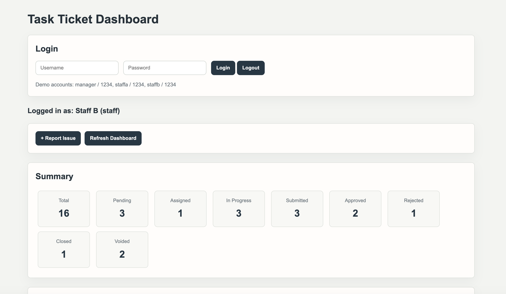
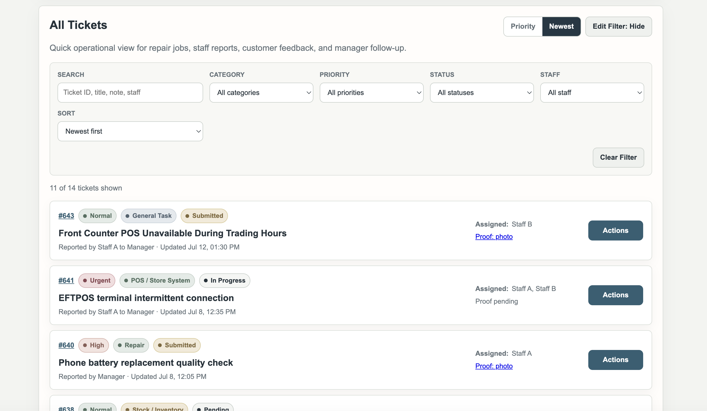
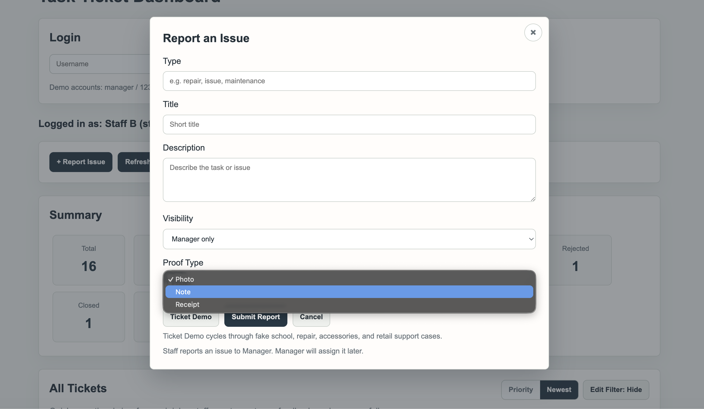
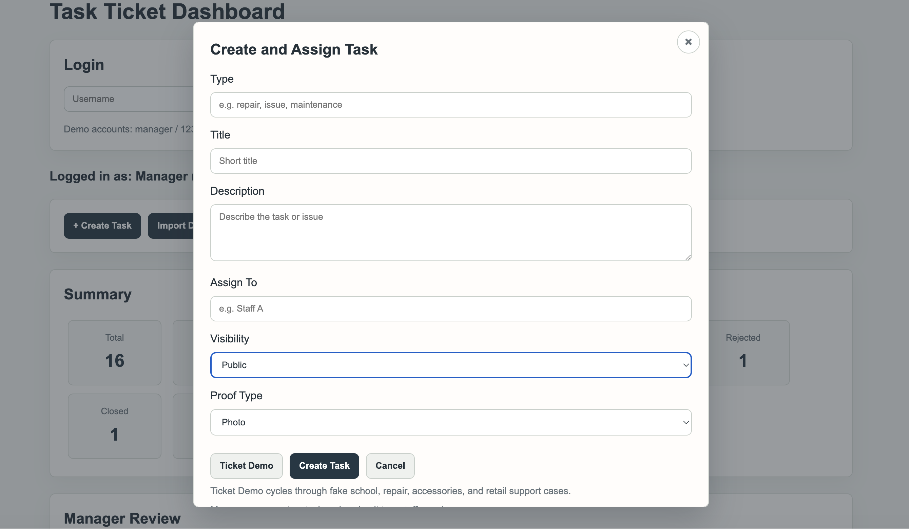
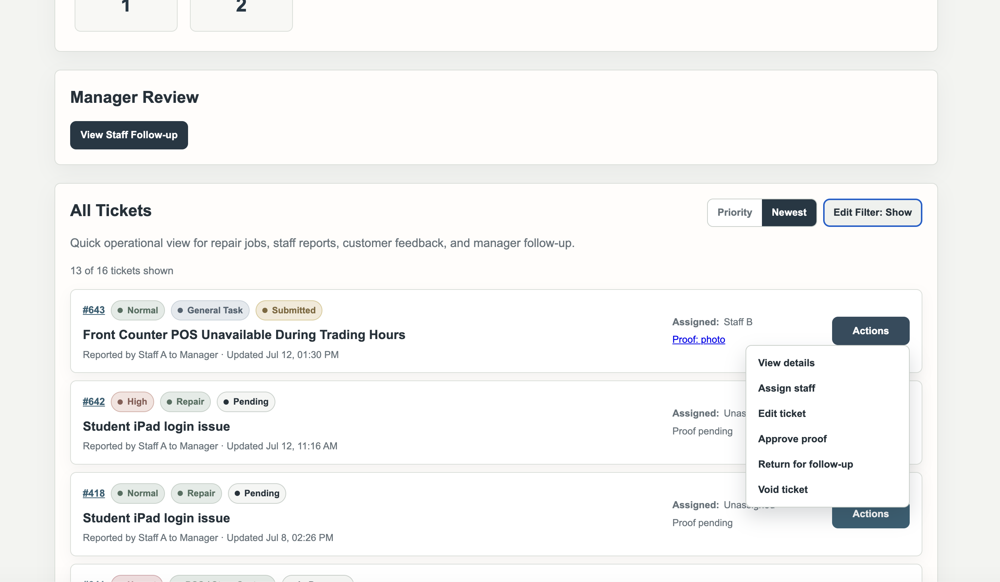
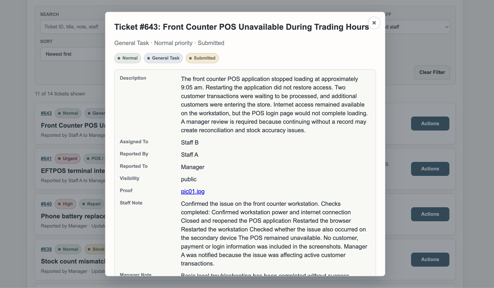
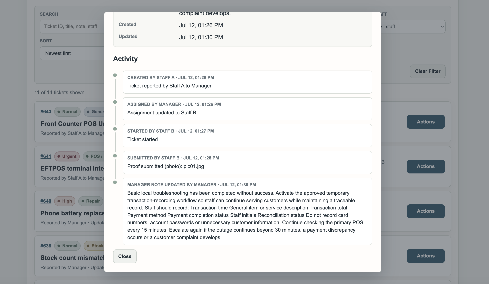
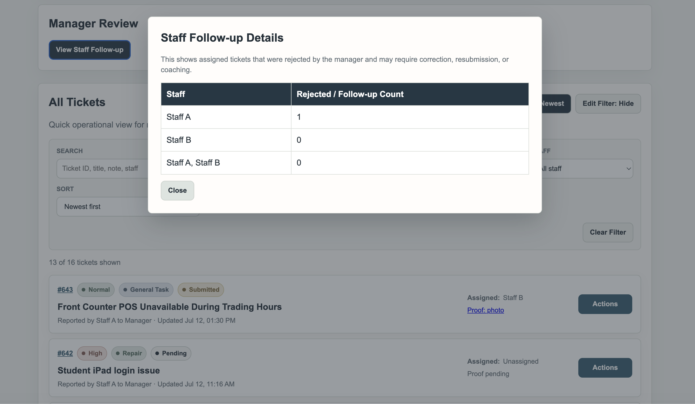

# Helpdesk Ticketing System Project

A practical Flask and SQLite ticket workflow prototype for ICT support, retail technology support, and repair-oriented service environments.

This project demonstrates how support requests can be logged, assigned, tracked, reviewed, corrected, and documented with clear staff and manager visibility.

It was built as part of my ICT support portfolio, combining my ICT bachelor learning with four years of retail management experience in customer-facing troubleshooting, service follow-up, documentation, handover, and operational accountability.

This is a local learning prototype, not a production ITSM system.
All data used in this project is fake demo data.

---

## Purpose

In ICT support and retail technology environments, resolving an issue is only one part of good service delivery.

A useful workflow also needs clear intake, accurate status tracking, service notes, follow-up records, manager review, escalation history, and enough context for another person to understand what happened.

This project was created to practise those support behaviours through a simple ticket workflow.

---

## Current Features

### Ticket Management

* Create tickets with title, description, category, priority, visibility, and assigned staff
* Track ticket status across pending, assigned, in progress, submitted, approved, rejected, closed, and voided states
* Edit ticket details and assignment as a manager
* Use fake demo ticket data for safe local testing

### Staff Workflow

* View assigned tickets
* Start assigned work
* Submit proof notes or completion evidence
* View rejected tickets requiring follow-up
* Resubmit corrected work after manager feedback

### Manager Workflow

* Assign or edit ticket ownership
* Review submitted work
* Approve, reject, close, or void tickets
* Add manager notes and rejection comments
* Return work with clear correction reasons

### Record Keeping

* Maintain audit history for ticket actions
* Show dashboard-style ticket summaries
* Track workload and follow-up needs
* Keep records clear enough for handover and later review

---

## Support Workflow

The system follows a basic support lifecycle:

1. Create a support request or operational task
2. Record the issue, category, priority, and assigned staff member
3. Track the ticket as work moves forward
4. Staff starts work and submits proof notes
5. Manager reviews the submitted work
6. Manager approves, rejects, closes, or requests follow-up
7. Staff corrects and resubmits if required
8. The system keeps an audit history of ticket actions

---

## Project Screenshots

The screenshots below use fake demo data only. They are included to show the support workflow, not real workplace records.

### Staff Dashboard and Ticket Overview

The dashboard gives staff and managers a quick view of ticket volume, status counts, assigned work, and demo login access.



### Ticket Search and Filtering

Tickets can be searched, filtered, sorted, and reviewed from a single operational list.



### Staff Issue Reporting

Staff can report an issue with type, title, description, visibility, and proof type.



### Manager Task Creation

Managers can create tasks, assign staff, set visibility, and choose proof requirements.



### Manager Review Actions

Managers can open ticket actions such as viewing details, assigning staff, editing tickets, approving proof, returning work for follow-up, or voiding a ticket.



<details>
<summary>More workflow screenshots</summary>

### Ticket Details

The ticket detail view shows the issue description, assignment, reporter information, visibility, proof reference, staff notes, manager notes, and timestamps.



### Activity History

Each ticket keeps an activity record so the workflow can be reviewed later for handover, follow-up, and accountability.



### Staff Follow-up Review

The manager follow-up view highlights rejected or returned work that may require correction, resubmission, or coaching.



</details>

---

## Example Use Case

A staff member is assigned a device check, repair follow-up, customer issue, or store technology task.

They complete the work and submit supporting notes. A manager reviews the submission and either approves it or returns it with feedback. If returned, the staff member corrects the issue and resubmits.

The record can later support handover, repeated issue review, SOP improvement, and staff training.

---

## Technology Used

* Python
* Flask
* SQLite
* HTML templates
* Vanilla JavaScript
* Local fake demo data

---

## How to Run Locally

```bash
pip install -r requirements.txt
python app.py
```

Then open:

```text
http://127.0.0.1:5002/
```

---

## Demo Login

| Role    | Username | Password |
| ------- | -------- | -------- |
| Manager | manager  | 1234     |
| Staff   | staffa   | 1234     |
| Staff   | staffb   | 1234     |

---

## Privacy and Safety Boundary

This project only uses fake or recreated demo information.

It must not include:

* Real customer names
* Real staff names
* Real business names
* Real workplace images
* Real SOP documents
* Real payment, warranty, refund, or repair records
* Real phone numbers, emails, addresses, serial numbers, IMEI numbers, or internal records

---

## What This Demonstrates

This project demonstrates practical ICT support thinking, including:

* Clear ticket intake and status tracking
* Role-based staff and manager workflows
* Service notes and proof submission
* Manager review and correction logic
* Rejection, follow-up, and resubmission handling
* Audit history and handover visibility
* Privacy-aware use of fake demo data
* Workflow improvement thinking for SOPs, onboarding, and training

---

## Roadmap

Planned improvements:

* Improve manager assignment and edit flows
* Strengthen ticket status transitions
* Add focused tests for key workflow actions
* Add a guided demo route with fake users and fake tickets
* Add structured SOP guidance cards using fake demo content
* Improve safe fake demo data

---

## Current Status

This is an active learning prototype intended for local demonstration and portfolio discussion.

The current focus is to keep the workflow stable, use safe fake demo data, and present the project clearly as an ICT support and retail operations workflow example.
